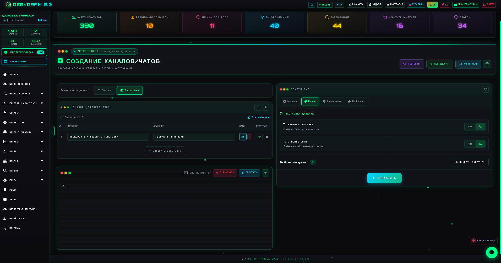
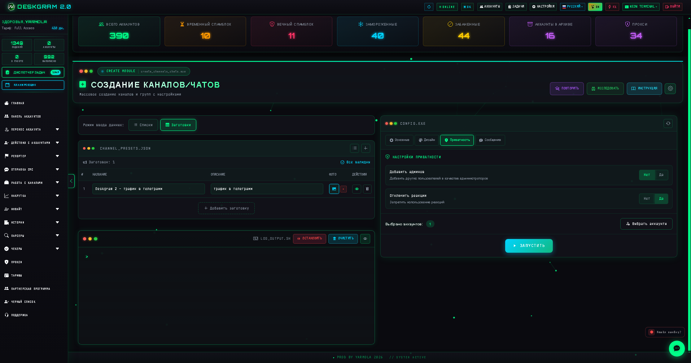
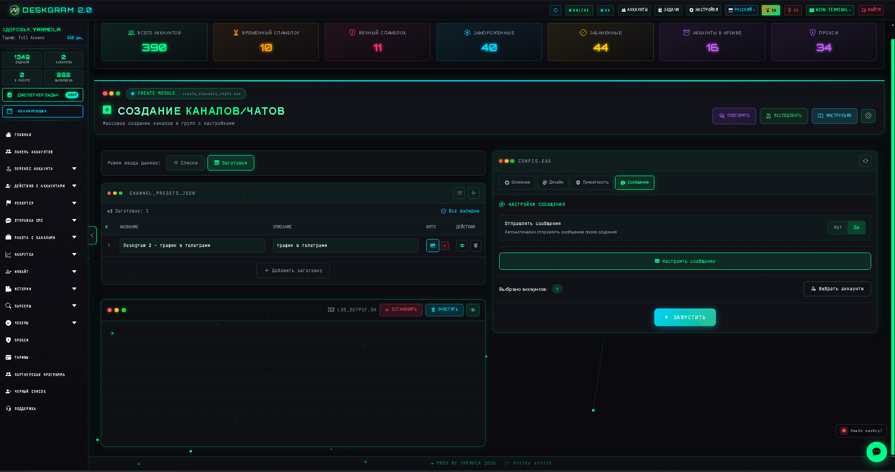
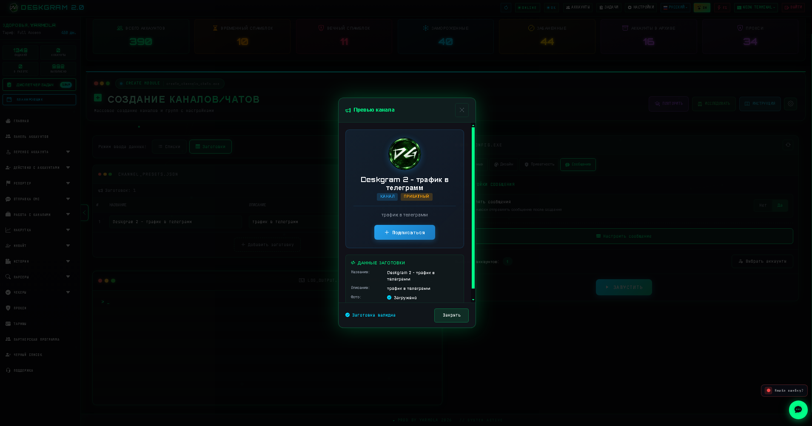

# Создание Telegram-каналов и групп через Deskgram 2

Создание каналов и групп в Deskgram 2 помогает массово разворачивать Telegram-инфраструктуру: от публичных и приватных каналов до рабочих чатов с нужными настройками, оформлением и первым контентом. Это хороший модуль, когда нужно строить сеть площадок системно, а не вручную по одной.

[Главный хаб Deskgram 2](https://github.com/Deskgram-2/deskgram-2-telegram-automation) · [Сайт](https://deskgram2.com/) · [Telegram-бот](https://t.me/DG2welcomebot) · [Web preview](https://deskgram2.com/web-preview)
## Интерактивный Web Preview

Попробовать модуль в браузере: [Открыть веб-превью](https://deskgram2.com/web-preview?path=%2Fapp-demo%2Ffunctions%2Fcreate_channels_chats)

## Скриншоты

## Кратко о модуле

| Параметр | Что внутри |
|---|---|
| Основная задача | Массовое создание Telegram-каналов и групп |
| Важные блоки | Режимы списков и пресетов, основные настройки, дизайн, приватность, сообщения |
| Полезен для | Развертывания инфраструктуры, запуска сетки площадок, подготовки рабочих каналов |
| Связанные модули | Панель аккаунтов, Инвайт, Создание ботов |

## Что умеет модуль

- создавать публичные и приватные каналы;
- создавать публичные и приватные группы;
- задавать названия, описания, фото и usernames;
- добавлять администраторов и настраивать дополнительные параметры;
- отправлять первое сообщение после создания;
- вести статистику, логи и сохранять результаты.

## Быстрый старт

1. Выберите режим списков или пресетов.
2. Подготовьте названия, usernames и описания.
3. Настройте тип площадок и количество на аккаунт.
4. При необходимости задайте оформление и первое сообщение.
5. Запустите задачу и контролируйте результат по логам.

## Что часто идет после создания площадок

- [Инвайт](https://github.com/Deskgram-2/telegram-invite-tool-deskgram), если новые группы и каналы сразу нужны под рост аудитории;
- [Создание ботов](https://github.com/Deskgram-2/telegram-bot-creator-deskgram), если площадки входят в более широкую Telegram-инфраструктуру;
- [Панель аккаунтов](https://github.com/Deskgram-2/telegram-account-manager-deskgram), если нужно связать созданные сущности с конкретной рабочей сеткой;
- [Настройки](https://github.com/Deskgram-2/telegram-automation-settings-deskgram), если после развертывания донастраиваются системные параметры;
- [Диспетчер задач](https://github.com/Deskgram-2/telegram-task-manager-deskgram), если вы отслеживаете массовое создание и последующие действия централизованно.

## Как устроен сценарий

### Режим подготовки

Можно работать как от простых списков, так и от более структурированных пресетов. Это удобно и для одиночных задач, и для масштабного развертывания.

### Настройки создания

Основной блок отвечает за тип сущности, публичность, количество, задержки и прочие параметры, влияющие на итоговую архитектуру сетки.

### Оформление и сообщения

Дизайн, описания, фото и стартовые сообщения помогают не просто создавать площадки, а сразу доводить их до рабочего состояния.

## Когда особенно полезен

- когда нужно быстро развернуть много Telegram-каналов или групп;
- когда важна единая логика оформления и настроек;
- когда площадки создаются как часть более крупной инфраструктуры;
- когда вы хотите сократить ручную сборку сетки.

## Почему это сильнее ручного создания

| Ручной подход | Создание каналов и групп в Deskgram 2 |
|---|---|
| Медленно и однообразно | Работает пакетно |
| Сложно держать единый стандарт | Настройки централизованы |
| Тяжело масштабировать на много аккаунтов | Модуль строит сетку системно |
| Мало контроля по результату | Есть логи и статистика |

## Смежные репозитории

- [Главный хаб Deskgram 2](https://github.com/Deskgram-2/deskgram-2-telegram-automation)
- [Панель аккаунтов](https://github.com/Deskgram-2/telegram-account-manager-deskgram)
- [Инвайт](https://github.com/Deskgram-2/telegram-invite-tool-deskgram)
- [Создание ботов](https://github.com/Deskgram-2/telegram-bot-creator-deskgram)
- [Настройки](https://github.com/Deskgram-2/telegram-automation-settings-deskgram)
- [Диспетчер задач](https://github.com/Deskgram-2/telegram-task-manager-deskgram)

## FAQ

### Модуль умеет работать и с каналами, и с чатами?

Да. В этом и его ценность: одна точка управления для нескольких типов площадок.

### Можно ли заранее подготовить структуру названий и usernames?

Да, это как раз один из главных сценариев использования.
